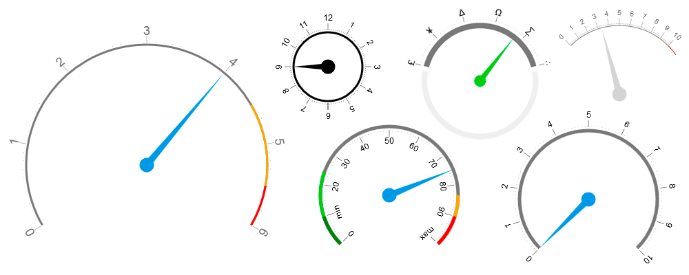

# Gauge.js

Pure Javascript компонент, отрисовывающий круговую шкалу через canvas. Без использования каких-либо библиотек, фреймворков, спрайтов - он весит всего 2.58 Кб. Имеет множество настроек для кастомизации внешнего вида, прост в использовании.

> [Демонстрация работы](http://dmnv.ru/gauge-demo/)



## Установка
Скачайте [gauge.min.js](http://dmnv.ru/gauge-demo/gauge.min.js) или полную версию [gauge.js](http://dmnv.ru/gauge-demo/gauge.js) и вставьте при помощи тега script:

```html
<script src="gauge.min.js"></script>
```

Компонент также можно установить через npm:
```sh
npm install dn-gauge.js
```

## Использование

Пример вызова без параметров:
```javascript
gauge = new Gauge({},document.getElementById("container"));
```

Вызов с параметрами:
```javascript
gauge = new Gauge({
width: 500,
height:500,
aperture: 240,
radius: 175,
areas:[
	{
		color: '#ffa500',
		start: 150,
		end: 190
	},
	{
		color: 'red',
		start: 190,
		end: 210
	}
],
values:[0,1,2,3,4,5,6],
angle: 2/3,
scaleInside : false,
arrowColor: '#1e98e4',
dotColor: '#777',
font: '18px Arial',
textColor: '#777',
arcWidth: 3
}, 
document.getElementById("container"));
```
## Параметры 

  Параметр               | Описание                | Значение               |
-------------------------|-------------------------|------------------------|
width                    | Ширина canvas           | Число(300, 500 и т.д.) |
height                   | Высота canvas           | Число(300, 500 и т.д.) |
aperture                 | Апертура(в градусах)    | Число(180, 270 и т.д.) |
radius                   | Радиус шкалы(в градусах)| Число(50, 100 и т.д.)  |
areas                    | Цветные области         | Масив областей. Каждая область должна иметь следующие свойства:    |
                    |          | start - начало области в градусах   |
                    |          | end - конец области в градусах   |
                    |          | color - цвет области (любое css-значение цвета)   |
values                   | Массив значений на шкале| Массив чисел или строк. [0, 'min', 20, 30, 40, 50, 60, 70, 80, 90, 'max']  |
arrowColor                   | Цвет стрелки| Цвет в css - hex, rgba или название цвета. Например 'red', '#ccc', '#00ff00', 'rgba(0,0,0,0.5)' |
arcColor                 | Цвет дуги шкалы| Цвет в css - hex, rgba или название цвета. Например 'red', '#ccc', '#00ff00', 'rgba(0,0,0,0.5)' |
textColor                  | Цвет текста и насечек под текстом| Цвет в css - hex, rgba или название цвета. Например 'red', '#ccc', '#00ff00', 'rgba(0,0,0,0.5)' |
dotColor                  | Цвет точек между значениями| Цвет в css - hex, rgba или название цвета. Например 'red', '#ccc', '#00ff00', 'rgba(0,0,0,0.5)' |
angle                   | Позиция стрелки          | Число от 0 до 1 (0 - крайнее минимальное положение, 1 - крайнее максимальное). Например: 0, 0.5, 0.999, 1/3, 2/5 и т.д. |
scaleInside                    | Вывести значения внутрь шкалы           | true или false. По умолчанию - false |
font                    | Шрифт, размер, начертание - через css          | '12px Arial', 'italic 10px Tahoma' и т.д. |
checkAreas                    | Проверка цветных областей на вхождение в границы дуги. Если установлен в true, то области, выходящие за пределы дуги будут обрезаны.          | true или false. По умолчанию - false |
arcWidth                    | Ширина дуги           | Число(1, 2, 5 и т.д.) |


